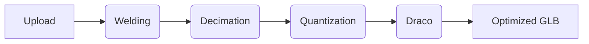

<p align="center">
  <a href="https://github.com/Microck/glob">
    
  </a>
</p>

<p align="center">high-performance glb compressor for aggressive mesh decimation and geometry optimization.</p>

<p align="center">
  <a href="LICENSE"></a>
  <a href="https://nodejs.org/"></a>
  <a href="https://react.dev/"></a>
</p>

<p align="center">
  [add high-resolution preview gif or screenshot here]
</p>

---

### quickstart

**clone and prep**

```bash
git clone https://github.com/microck/glob.git
cd glob
npm install
```

**run it**

you need two terminals. one for the processing api and one for the frontend.

```bash
# terminal 1
npm run api:dev

# terminal 2
npm run dev
```

check `.env.example`. you need keys for supabase, clerk, and cloudflare r2.

---

### features

glob is a logic engine for shrinking 3d assets. i built it because 50mb glb files shouldn't exist on the web.

- **mesh decimation:** removes polygons using `meshoptimizer`. drops the weight without losing the silhouette.
- **draco compression:** standard geometry compression. reduces data footprint for faster delivery.
- **texture optimization:** resizes oversized textures to a max resolution. saves gpu memory on the client.
- **bulk processing:** upload 10 files at once. the backend processes them and returns a zip.
- **storage quota:** 1gb persistence for premium users via supabase. files live in cloudflare r2.

---

### how it works



1. **ingest:** parses the buffer into a document object.
2. **weld:** merges duplicate vertices. essential step before simplification.
3. **decimate:** collapses edges based on your target ratio.
4. **quantize:** reduces bit-depth of vertex attributes.
5. **compress:** applies draco for the final binary reduction.

---

### usage

the api handles multipart forms. send your `.glb` and a settings object.

```json
{
  "decimateRatio": 0.5,
  "dracoLevel": 7,
  "textureQuality": 2048,
  "weld": true
}
```

it returns a success status with download links and gain statistics.

---

### project structure

```
glob/
├── api/             # express processing engine
│   └── src/
│       └── services/ # meshopt, r2, supabase logic
├── src/             # react frontend
│   ├── components/  # viewers, progress bars
│   └── lib/         # api client
└── public/          # static assets
```

---

### troubleshooting

| problem | cause | fix |
| :--- | :--- | :--- |
| holes in mesh | high decimation | increase ratio or ensure weld is on. |
| missing textures | external links | use packed .glb files only. |
| upload fails | server limit | check your proxy body size limits. |

---

### license

o'saasy license. use it for internal tools or personal projects. don't use this code to launch a competing 3d optimization service.
