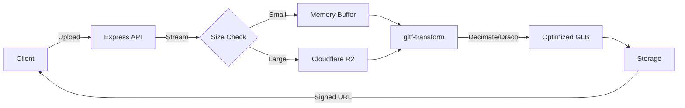

<p align="center">
  <a href="https://glob.micr.dev">
    
  </a>
</p>

<p align="center">**ACID BRUTALIST 3D OPTIMIZER**</p>
<p align="center">High-performance GLB/GLTF compressor with aggressive mesh decimation, Draco compression, and texture resizing.</p>

<p align="center">
  <a href="LICENSE"></a>
  <a href="https://nodejs.org/"></a>
  <a href="https://react.dev/"></a>
  <a href="https://polar.sh/"></a>
</p>

---

### **THE ENGINE**

**glob** is a logic engine for shrinking 3D assets. Built because 50MB GLB files shouldn't exist on the web.

- **Mesh Decimation:** Intelligent polygon reduction using `meshoptimizer`.
- **Draco Compression:** Google's geometry compression for minimal footprint.
- **Texture Resizing:** Auto-scale textures to 1K/2K/4K limits to save VRAM.
- **Bulk Processing:** Queue 10+ files. Get them back optimized.
- **Visualizer:** Real-time before/after comparison with wireframe/clay modes.

### **THE TIERS**

| Feature | Guest | Globber ($8/mo) |
| :--- | :--- | :--- |
| **File Limit** | 300 MB | 500 MB |
| **Retention** | 10 Minutes | 48 Hours |
| **Storage** | Local Session | 1 GB Persistent Vault |
| **Processing** | Standard | Priority Queue |
| **Bulk** | Single File | Multi-File Batch |

---

### **QUICKSTART**

**1. Clone & Install**

```bash
git clone https://github.com/microck/glob.git
cd glob
npm install
```

**2. Configure Environment**

Copy `.env.example` to `.env` and fill in the keys:

```bash
# Frontend
VITE_CLERK_PUBLISHABLE_KEY=pk_test_...
VITE_SUPABASE_URL=https://...
VITE_SUPABASE_ANON_KEY=...
VITE_API_URL=http://localhost:3001

# Backend
CLERK_SECRET_KEY=sk_test_...
SUPABASE_SERVICE_ROLE_KEY=...
R2_ACCOUNT_ID=...
R2_ACCESS_KEY_ID=...
R2_SECRET_ACCESS_KEY=...
R2_BUCKET_NAME=glob-models
POLAR_ACCESS_TOKEN=...
POLAR_SUCCESS_URL=http://localhost:5173/success?checkout_id={CHECKOUT_ID}
```

**3. Run It**

Fire up the twin engines (Frontend + API):

```bash
# Terminal 1: API (Port 3001)
npm run api:dev

# Terminal 2: Frontend (Port 5173)
npm run dev
```

---

### **ARCHITECTURE**



**Tech Stack:**
- **Frontend:** React, Vite, Tailwind, Shadcn/UI, Three.js (R3F)
- **Backend:** Express, Node.js, gltf-transform
- **Auth:** Clerk + Supabase (RLS)
- **Storage:** Cloudflare R2 (S3 Compatible)
- **Commerce:** Polar.sh

---

### **LICENSE**

**O'Saasy License.**
You can use this code for internal tools, personal projects, or learning.
You **cannot** use this code to launch a competing 3D optimization SaaS.
If you make millions using this, buy me a coffee (or a house).
