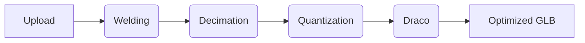

  

high-performance glb compressor for aggressive mesh decimation and geometry optimization.

  
  
  
  

  

---

### features

glob is a logic engine for shrinking 3d assets. i built it because 50mb glb files shouldn't exist on the web.

- **mesh decimation:** removes polygons using `meshoptimizer`. drops weight without losing silhouette.
- **draco compression:** google's geometry compression for minimal footprint.
- **model sharing:** generate persistent share links with interactive 3D previews and stats.
- **texture resizing:** auto-scale textures to 1k/2k/4k limits. saves vram.
- **bulk processing:** queue 10 files. get them back optimized.
- **globber tier:** $8/mo via polar. 500mb limits, 48h retention, persistent vault.

---

### how it works

1. **ingest:** parses buffer into document object.
2. **weld:** merges duplicate vertices. essential before simplification.
3. **decimate:** collapses edges based on target ratio.
4. **quantize:** reduces bit-depth of attributes.
5. **compress:** applies draco for final reduction.

---

### stack

- **frontend:** react, vite, tailwind, shadcn, three.js
- **backend:** express, node, gltf-transform
- **infra:** cloudflare r2 (storage), supabase (auth/db), clerk (auth), polar (payments)

---

### license

o'saasy license. use it for internal tools or personal projects. don't use this code to launch a competing 3d optimization service.
